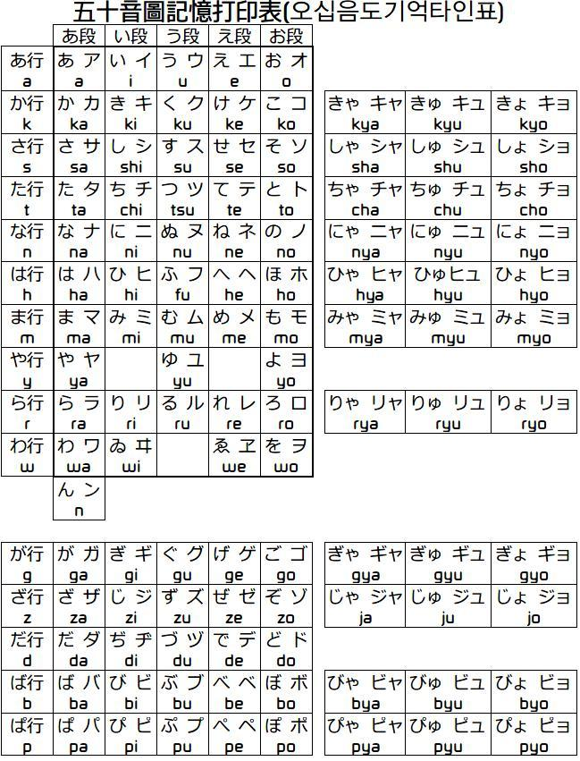

[教程](https://www.bilibili.com/video/BV1vg411176y?p=2&vd_source=f0fc0819c519290af744b0a942a85c0e)

# 日语学习笔记

## day1
五十音图

日汉字：写法一样、意思一样，但读音不一样

平假名：类似汉语中的拼音

罗马音：用来标注平假名

平假名用于对日汉字进行注音，而罗马音用于对平假名进行标注。

**日汉字的分类：**
简体

繁体

和字：中文汉字拼凑而成，造字。

片假名：用于对其他语系（英语等）进行标注

46个平假名（标注日汉字）；
46个片假名（标注外来文）；

