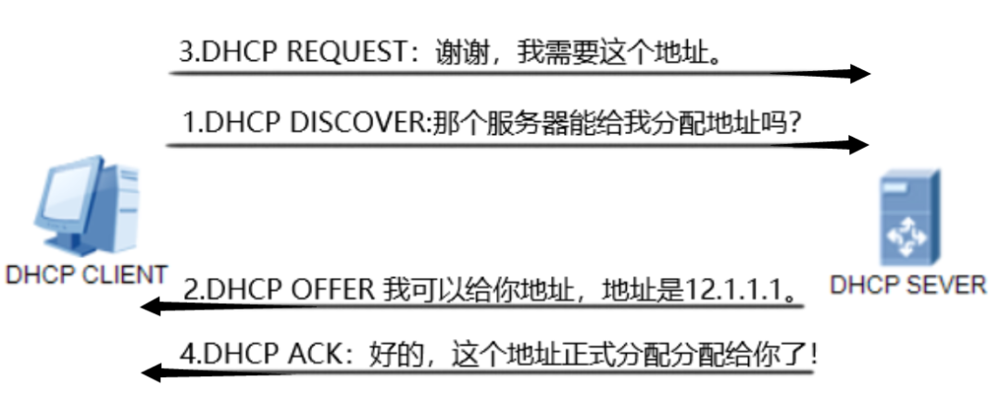

# 计算机网络知识
## 计算机常见网络协议汇总
* 网络层
  IP、ICMP、IGMP、IS-IS、IPsec、ARP、RARP、RIP等。
* 传输层
  TCP、UDP、TLS、SSL、OSPF等。
* 应用层
  DHCP、DNS、FTP、HTTP、POP3、SNMP、SSH、TELNET、BGP等。
* 

## DHCP协议
DHCP(Dynamic Host Configuration Protocol，动态主机配置协议)是一种网关协议，它允许计算机在加入网络时自动获取网络配置信息，如IP地址、子网掩码、默认网关，DNS服务器等。通俗来说，DHCP就像是一个网络中的自动IP地址分配器。
目的：无IP地址的计算机获取IP地址。

过程：
 
1. 计算机连接网线，开机，计算机网卡自动**广播请求IP地址**，这一过程成为DHCP Discover。
2. DHCP服务器收到广播消息，从IP池中找一个未分配的IP地址并把该地址通过DHCP Offer，DHCP提供一个给电脑。（此时计算机没有IP地址，那么服务器是怎么发给指定计算机的？）
3. 计算机接受这个DHCP Offer发送过来的包，并广播DHCP Request。
4. DHCP服务器收到计算机发送的DHCP Request之后，发送一个DHCP ACK消息给计算机。

注：如果网络中有多个DHCP服务器，那么计算机的DHCP Discover广播出去之后，第一个DHCP服务器回包的，计算机就会和第一个DHCP服务器建立联系，从而正式获取到IP地址。

## arp协议

## JWT、Cookies、Token、Session知识辨析
前提：HTTP无状态
作用：保持用户登录状态

* Cookie
  形式：键值对
  缺点：采用Cookies保存用户名和密码不安全，因此进一步提出Session概念。
* Session
  会话时间、会话ID（本质也是Cookie）
  缺点：服务器需要存储用户的Cookie信息，当用户数据量过大时对服务器造成存储压力。在进行分布式应用时，提出了JWT（Json Web Token）概念。
* JWT
  用户第一次登录应用之后，服务器生成对应的JWT发送给客户端并保存在客户端。
  JWT由3部分组成：header.payload.signature。

  总结：Session是诞生并保存在服务器端，由服务器主导一切。Cookie是一种数据载体，把Session数据放入Cookie送到客户端。Token是诞生在服务器一段，保存在浏览器，由客户端主导一切，可以放在Cookie或者Storage中（类似令牌）。

